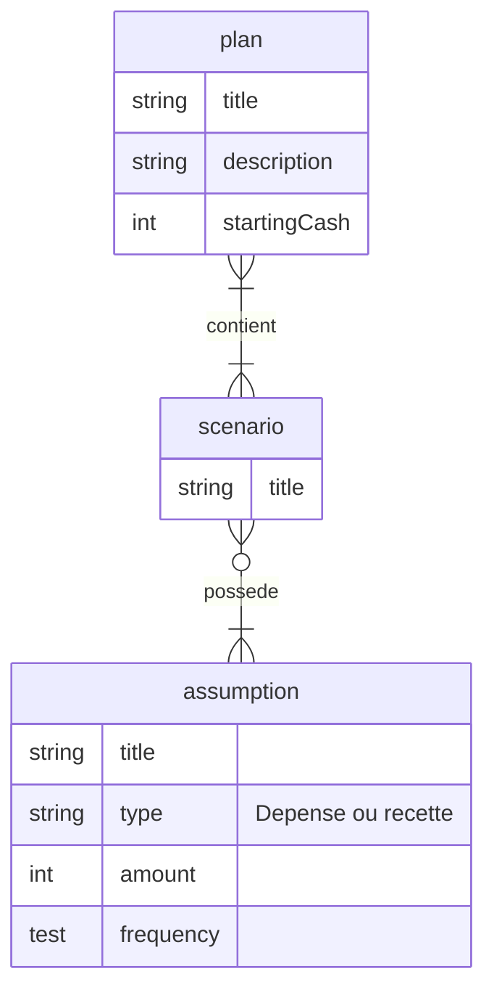

# Architecture

## Concepts

Plan de trésorie
cash flow plan

Scénario
scenario

Hypothèse
assumption

## Database shema

```mermaid

erDiagram

plan {
    string title
    string description
    int startingCash
}
scenario {
    string title
}
assumption {
    string title
    string type "Depense ou recette"
    int amount
    test frequency
}

plan }|--|{ scenario : contient
scenario }o--|{ assumption : possede

```